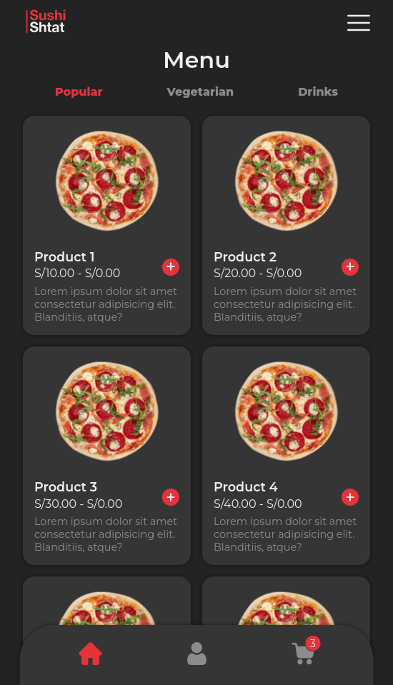
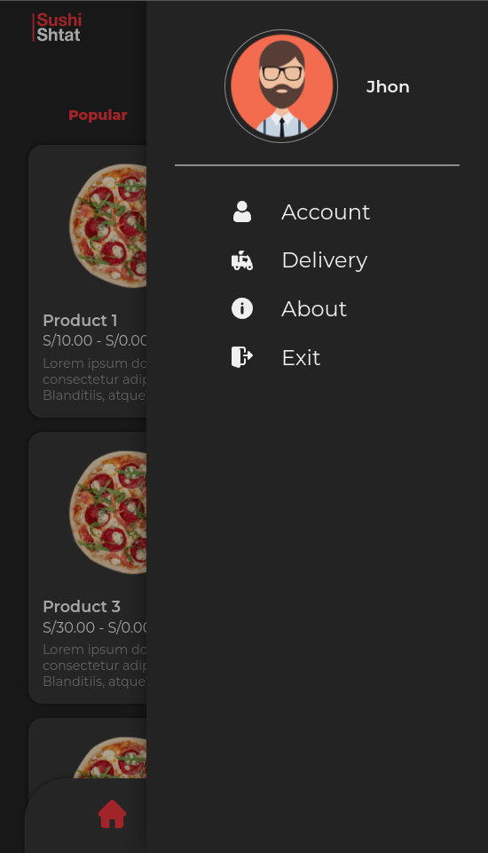

# Delivery Webapp UX

A inmplementation of an ux design

## Table of Contents

- [Delivery Webapp UX](#delivery-webapp-ux)
  - [Table of Contents](#table-of-contents)
  - [Motivation](#motivation)
  - [Technologies](#technologies)
  - [Screenshots](#screenshots)
  - [Installation](#installation)
  - [References](#references)

## Motivation

adasdasd

## Technologies

Some of the technologies that were used to build this project.

- [Vue.js](https://vuejs.org/)
- [Sass](https://sass-lang.com/)
- [Vite](https://vitejs.dev/)

  
  
  

## Screenshots

Some of the main views of the project.

  
  

## Installation

asdasdasd

## References

asdass