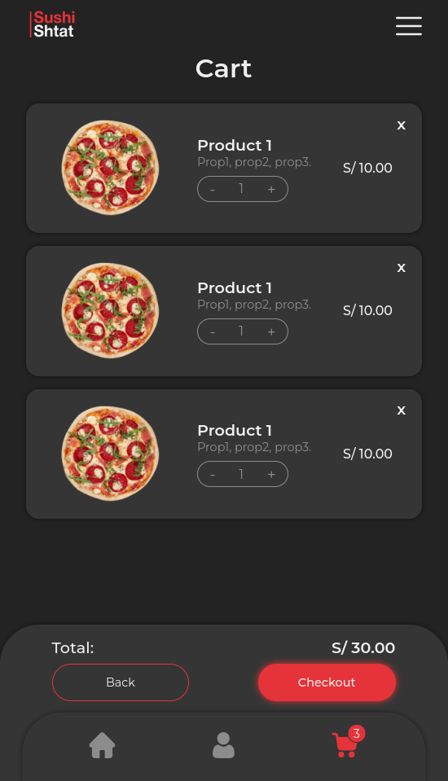
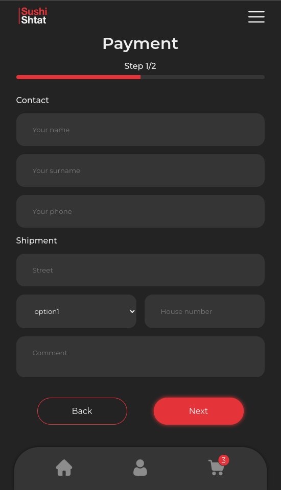
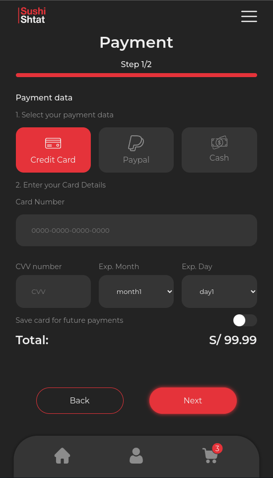
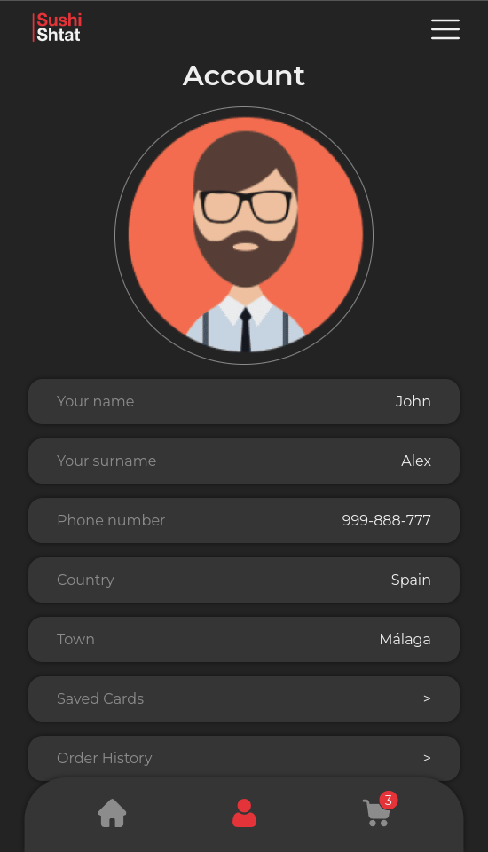
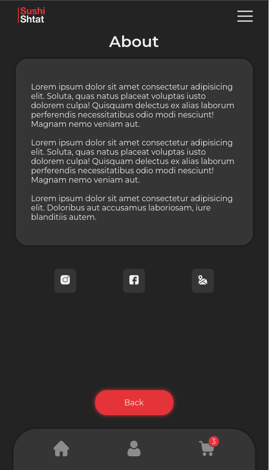
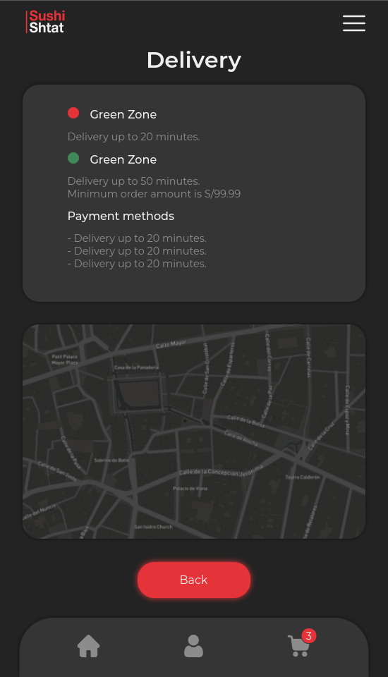

# Delivery Webapp UX

An implementation of an external `UX Design Project`, with some of the provided application functionality and `user workflow`.

## Table of Contents

- [Delivery Webapp UX](#delivery-webapp-ux)
  - [Table of Contents](#table-of-contents)
  - [Motivation](#motivation)
  - [Technologies](#technologies)
  - [Screenshots](#screenshots)
  - [Installation](#installation)
  - [References](#references)

## Motivation

This project was made to experience the process of working with a predefined Ux guideline and `design system`, also to make the application styles with a `mobile first` approach. The result is intended to be an application that can be shipped with a mobile native runtime for web apps to make a mobile application.

## Technologies

Some of the technologies that were used to build this project.

- [Vue.js](https://vuejs.org/)
- [Sass](https://sass-lang.com/)
- [Vite](https://vitejs.dev/)

<div style="display:flex;justify-content:center;gap:16px">

  
  
  
</div>

## Screenshots

Some of the main views of the project.

<div style="display:grid;grid-template-columns:1fr 1fr 1fr 1fr;gap:2rem">














</div>

## Installation

```bash
# install dependencies
$ npm install
# serve with hot reload at localhost:3000
$ npm run dev
# build for production and launch server
$ npm run build
# serve the files from build step
$ npm run start
```
For more details, you can check [Vite Docs](https://vitejs.dev/)

## References

The documentation sites and other resources that help with the project.

- [Delivery App UX Design](https://www.behance.net/gallery/123791373/Food-Delivery-Mobile-App-UXUI)
- [Vue Docs](https://vuejs.org/)

